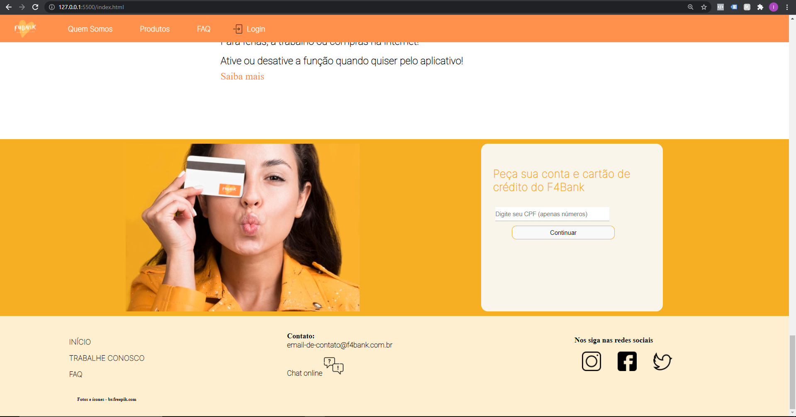
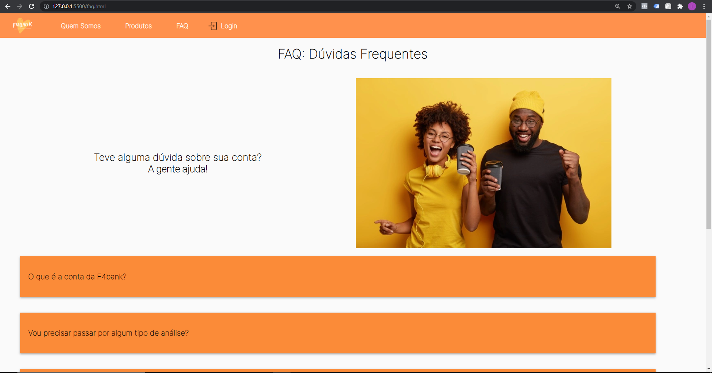
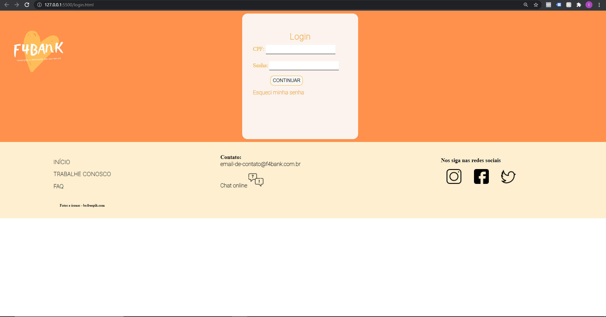

# WFS04 - Landing Page

O projeto consiste em uma landing page de um banco público brasileiro

Tabela de conteúdos
=================
<!--ts-->
   * HTML
   * CSS
   * Autores: Kyriale Cavalcanti, Stefani Moreira, Igor Matsuoka 
   * O que funciona?
        * O site se comporta muito bem para desktop
        * Os botões para navegar entre as páginas funcionam
        * Adicionamos função de login
        * O site é bem clean e fácil de usar
        * Atenção: alguns botões de "saiba mais" realmente não levam a lugar algum propositalmente
        
   * O que não funciona?
        * Tivemos dificuldade com a responsividade
        * Tentamos ficar dentro da proposta de usar apenas o css
        * O site mobile não apresenta a interface desejada pelo grupo
        * Alguns botões de navegação não funcionam no mobile
        * No "trabalhe conosco" o formulário não está respondendo corretamente, quando arrumamos o cabeçalho, ele some
<!--te-->

<h4 align="center"> 
	Prints
</h4>

     

    

     

     

 
<h4 align="center"> 
	Projeto concluído 
</h4>

# Link do surge: https://false-weather.surge.sh/